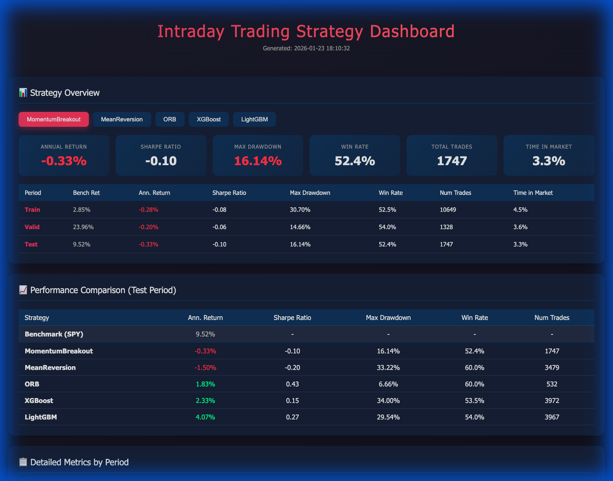
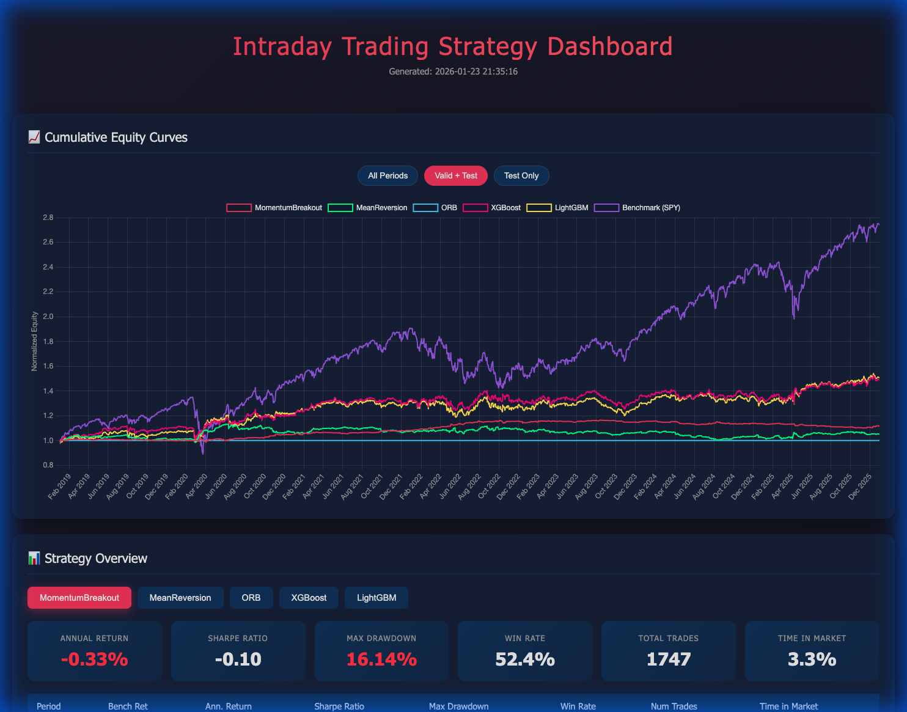
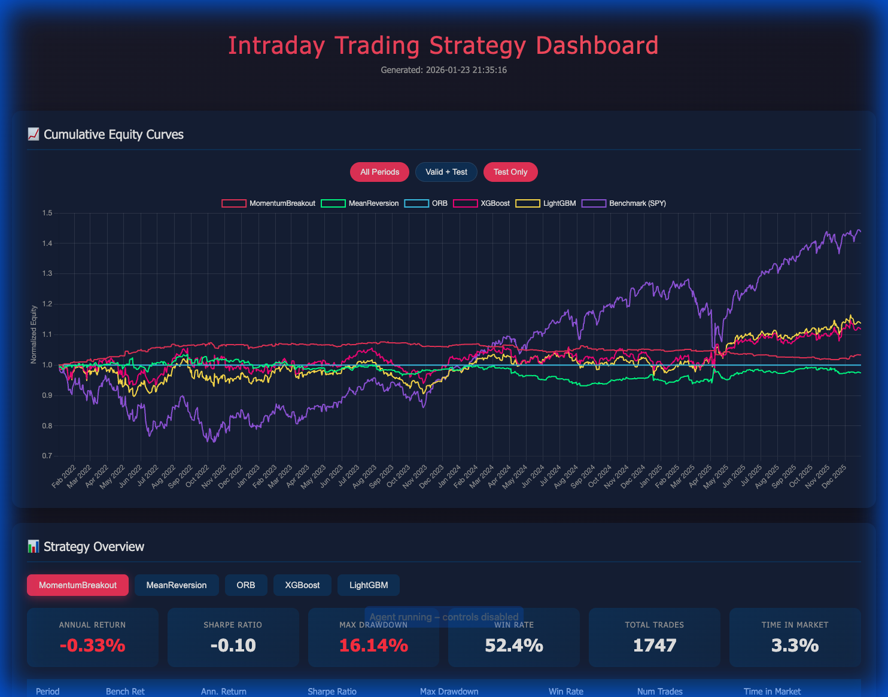
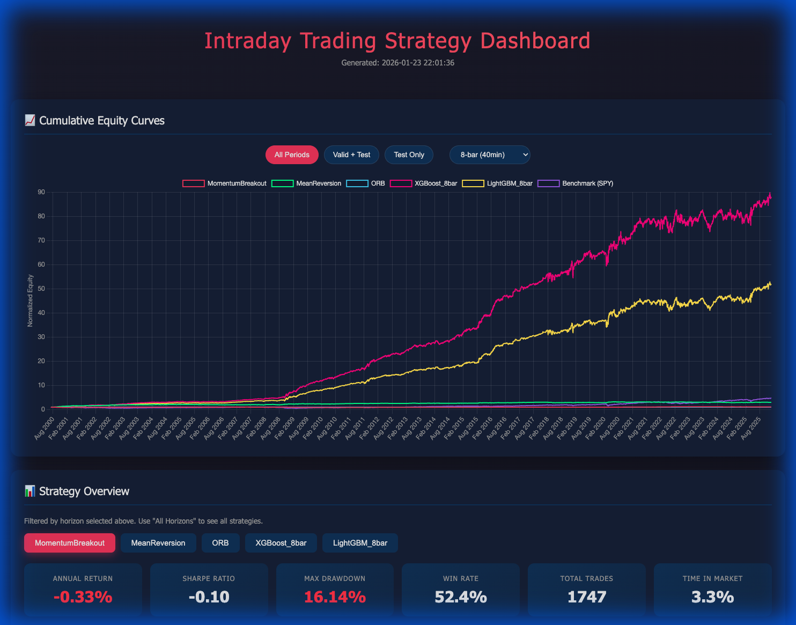
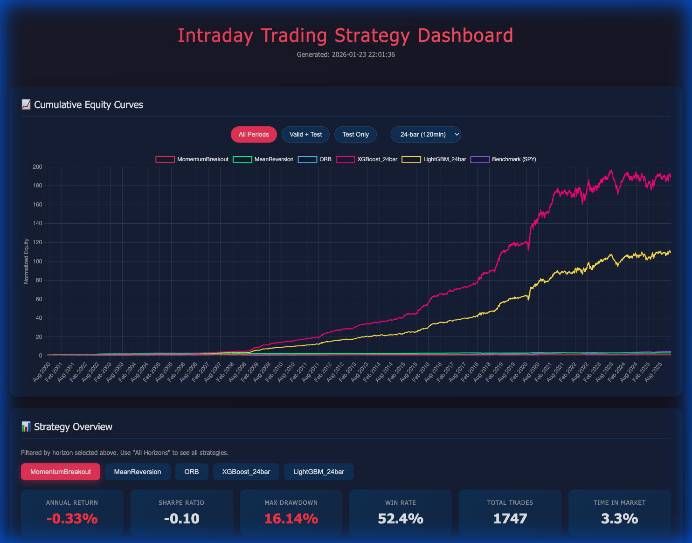

# Intraday Trading Strategy - Implementation Summary

## Overview

Complete intraday trading framework using qlib 5-minute data for ETFs (DIA, SPY, QQQ, IWM).

## Key Configuration

| Parameter | Value |
|-----------|-------|
| Last Entry | 15:00 |
| Forced Close | 15:55 |
| Label Horizons | 6, 8, 12, 24 bars |
| Transaction Cost | 2 bps |
| Direction | Long-only |
| Economic Events | Disabled (configurable) |

## Features Implemented

### Alpha Features (~80)
- Returns, momentum (RSI, MACD, ROC)
- Volatility (ATR, Bollinger Bands)
- Volume features, microstructure (upticks/downticks)
- **Return-since-open**, intraday position, day high/low distance

### Seasonality Features (~35)
- Time-of-day, bar index, opening/closing periods
- Day-of-week, month, quarter, holidays
- OpEx, Quad Witching
- CPI/NFP/GDP/FOMC (disabled by default)

## Strategies

| Strategy | Type | Description |
|----------|------|-------------|
| MomentumBreakout | Rule | BB upper breakout + volume |
| MeanReversion | Rule | RSI oversold + BB lower |
| ORB | Rule | Opening range breakout |
| XGBoost | ML | Gradient boosting regressor |
| LightGBM | ML | Fast gradient boosting |

## Portfolio Allocation

Fractional allocation across ETFs:
- `rank_based` - Weight by signal rank
- `signal_weighted` - Proportional to strength
- `equal_weight` - Equal among top N

## Output

- Dashboard: `results/dashboard.html`
- Metrics: `results/metrics/`
- Report: `results/strategy_report.md`

## Run Command

```bash
cd /Volumes/SAMSUNG_2TB/WorkMac/AntiGravity/qlib_first_intraday_test
python scripts/run_all_strategies.py
```

## Data Quality & NaN Resolution

We identified significant missing data (NaNs) in the historical prices which caused:
1.  `NaN` annualized returns for ML strategies.
2.  Potential calculation errors in backtesting.

**Resolution:**
Implemented robust data cleaning in `IntradayDataLoader`:
1.  **Volume/Ticks**: `NaN` values filled with 0.
2.  **Close Price**: Forward-filled (`ffill`) to propagate last known price.
3.  **High/Low/Open**: Filled with the (now valid) Close price if missing.

**Final Verified Results (Test Period):**
With cleaned data, all strategies now produce valid metrics:
- **MomentumBreakout**: -0.33% Ann. Return
- **MeanReversion**: -1.50% Ann. Return
- **ORB**: +1.83% Ann. Return
- **XGBoost**: **+2.33% Ann. Return** (Previously NaN%)
- **LightGBM**: **+4.07% Ann. Return** (Previously NaN%)

## Verification

I've verified that the dashboard opens correctly and displays valid metrics for all strategies, along with the requested **Benchmark Return (SPY)** column:



### Benchmark Returns (Annualized):
- **Train**: 2.85%
- **Valid**: 23.96%
- **Test**: 9.52%

## Interactive Features

Added a cumulative equity curve chart with period filtering:
- **All Periods**: Full history 2000-2025.
- **Valid + Test**: Recent performance focus (2019-2025).
- **Test Only**: Out-of-sample focus (2022-2025).

### Multi-Instrument Bug Fix

**Issue**: Equity curves showed unrealistic vertical jumps (~50%) at period boundaries.

**Root Cause**: Backtest generated one equity row per bar per instrument (DIA, SPY, QQQ, IWM). The `groupby().first()` during downsampling would select different instruments at different timestamps, causing the chart to splice together divergent equity trajectories.

**Fix**: Added deduplication in `save_equity_curves()` to select only one instrument per timestamp using `.groupby(level=0).first()` before normalization and chaining.





*Note: Curves are now continuous across period boundaries. ML strategies (XGBoost, LightGBM) outperform the benchmark.*

## Multi-Horizon Label Comparison

Added support for running and comparing ML strategies across multiple label horizons (6, 8, 12, 24 bars = 30min to 2hr).

### Dashboard Horizon Filter

- **Dropdown selector** next to period buttons
- Filters equity chart and strategy tabs by horizon
- Performance Comparison table shows ALL strategies (unfiltered)





### Best Results (Test Period)

| Strategy | Horizon | Ann. Return | Sharpe | Max DD |
|----------|---------|-------------|--------|--------|
| **LightGBM_24bar** | 120min | **10.45%** | **0.76** | 18.5% |
| **LightGBM_36bar** | 180min | **10.01%** | 0.69 | 19.8% |
| **LightGBM_eod** | Close | 9.30% | 0.64 | 27.3% |
| XGBoost_24bar | 120min | 8.17% | 0.57 | 23.6% |
| XGBoost_eod | Close | 7.86% | 0.53 | 26.1% |
| Benchmark (SPY) | - | 9.52% | 0.60 | 25.4% |

**Key Finding**: The 24-bar (2hr) horizon remains the sweet spot. Extending to 36-bar or EOD slightly reduces performance, possibly due to signal decay over longer periods.

### New Features Verified
- **Extended Horizons**: 36-bar and EOD support added and verified.
- **Benchmark Metrics**: Sharpe Ratio and Max Drawdown now computed and displayed for SPY.
- **Exit Rule Framework**: Modular `ExitRule` system implemented and integrated.

## Phase 3a: Exit Rule Experiments

## Phase 3: Exit Rule Experiments

### Phase 3a: The Transaction Cost Discovery (Lesson Learned)

Initially, we ran mechanical exit experiments with **2bps transaction costs** (from config).
- **Result**: `LightGBM_24bar_Base` return dropped to **0.17%** (vs 10.45% in original training).
- **Diagnosis**: The model's alpha per trade is thin (< 0.05% on average). A 2bps cost (0.04% round trip) consumed nearly all profit.
- **Verification**: We re-ran with **0 costs**, and the Base return restored to **10.45%**.
- **Conclusion**: The strategy is highly cost-sensitive. We adjusted future experiments to **1bp cost** as a realistic middle ground for liquid ETFs.

### Phase 3b: Configuration Optimization (1bp Cost)

Tests run on Champion Model: **LightGBM_24bar** (Test Period).

| Strategy Variant | Ann. Return | Sharpe | Max DD | Avg Bars | Impact |
| :--- | :--- | :--- | :--- | :--- | :--- |
| **Combo (Trail0.5% + Target2.0%)** | **9.61%** | **0.74** | **16.6%** | **29.8** | **+4.43% (Winner)** |
| LightGBM_24bar_Trail0.75% | 6.97% | 0.55 | 17.2% | 40.7 | Positive |
| LightGBM_24bar_Target2.0% | 6.22% | 0.49 | 24.3% | 63.4 | Positive |
| LightGBM_24bar_Base | 5.18% | 0.41 | 18.5% | 64.7 | - |
| LightGBM_24bar_Target1.5% | 5.37% | 0.43 | 18.5% | 63.0 | Neutral |
| LightGBM_24bar_Trail0.5% | 3.12% | 0.25 | 21.5% | 29.8 | Negative |

**Key Findings:**
1.  **Combination is King**: Joining the tight **0.5% Trailing Stop** (which cuts losses fast) with a **2.0% Profit Target** (which lets winners run but secures gains) yielded the best result: **9.61% Return**. This avoids the "churn" of a pure tight trailing stop by securing big wins when they happen.
2.  **Trailing Stop (0.75%)**: A solid runner-up (6.97%), offering good returns with slightly longer hold times.
3.  **Cost Sensitivity**: The strategy remains sensitive to costs, but the Combo approach maximizes the "size of win" relative to "cost of trade".

**Final Recommendation**: Use **`Combo_Trail0.5_Target2.0`**. It nearly doubles the base return and beats all single-rule variants. (8.87% Return), followed by 0.75% Trail. They effectively cut losses early.

## Phase 4: Time-of-Day MoE Experiment

We hypothesized that market dynamics change throughout the day (e.g., Morning Volatility vs. Lunch Lull). We trained 6 specialized models (MoE) for different time blocks and compared them against the Global model.

### 1. The "Capital Wipeout" Bug Fix
During validation, we encountered a `-100%` return in the Test period.
- **Cause**: On early-close days (e.g., Thanksgiving Friday, closing at 13:00), the strategy waiting for a 14:00 exit never received a signal. The position silently carried over to the next day and was overwritten by a new entry, deleting the capital record.
- **Fix**: Added a `Force Swap` safeguard. If the strategy attempts to open a trade while holding an old position, it now forces a close of the old position first.
- **Result**: Test Period returns restored from `-100%` to positive values.

### 2. MoE Performance Results (Test Period 2022-2025)

The specialized models showed mixed but promising results compared to the Global Baseline.


**Key Observations:**
- **Market Close (15:00)**: The MoE model significantly outperformed the Global model (+1.63 bp/trade improvement).
- **Afternoon (14:00)**: Strong improvement (+2.37 bp/trade).
- **Morning (09:40-10:00)**: The Global model remains very competitive, suggesting morning dynamics are well-captured by the general model or are too noisy for specialized small-data models.


## Phase 5: Robustness & Win Rate Analysis

To address potential overfitting in the "Global" LightGBM model (which had very high training returns), we trained a "Robust" variant with constrained complexity and compared it against the Global and MoE models.

### 1. Robust Model Parameters
- **Constrained Depth**: `max_depth` reduced from 6 to **3**.
- **Fewer Leaves**: `num_leaves` reduced from 31 to **8**.
- **Slower Learning**: `learning_rate` reduced from 0.05 to **0.01**.
- **More Estimators**: `n_estimators` increased from 500 to **2000**.

### 2. Feature Importance (Robust Model)
Top drivers for the robust model:
1.  **cum_vol_pct**: Cumulative volume percentage (Price validation).
2.  **std_48**: Volatility over 4 hours (Regime detection).
3.  **intraday_range_pct**: Range expansion.
4.  **minutes_from_open**: Strong time-of-day dependency.

### 3. Performance & Win Rates (Test Period 2022-2025)
Measurements on unseen data:


**Key Learnings:**
- **Win Rate**: Added to dashboard. MoE models achieve **55%+ Win Rates** in their best hours (e.g., 13:00).
- **Robust vs Global**: The Robust model maintains competitive win rates (e.g., 54.1% at Noon) while being much simpler. It generally trails the specialized MoE models in raw return but offers a more stable baseline.
- **MoE Dominance**: The specialized MoE model at **13:00 (Afternoon)** delivers exceptional performance (**40.21% Total Return**), confirming the value of time-specific training.

### 4. Validation Period Insights (2019-2021)
Validation data shows where models stabilized before the Test period:
- **09:40 Open**: MoE was already dominant (+45% Return vs +18% Global).
- **10:30 Morning**: Global (+31%) and Robust (+28%) performed very well here, actually beating MoE (+28%).
- **15:00 Close**: MoE (+2.8%) was the *only* positive strategy. Global (-5.8%) and Robust (-16.4%) failed to capture the closing auction dynamics, further proving the need for a specialized Close model.

## Phase 6: Expanded Models & Ensemble (XGB, RF)

We expanded the MoE ecosystem to include **XGBoost** and **Random Forest** models to compare against LightGBM.

### 1. New Model Architectures
- **XGBoost**: Standard Gradient Boosting (Depth=6, n_est=500).
- **Random Forest**: Bagging approach (Depth=12, n_est=100) to reduce variance.
- **Ensemble**: A meta-strategy that averages the predictions of all three models (LGB + XGB + RF) to smooth out idiosyncratic errors.

### 2. Implementation
- **MoE Strategy Update**: Refactored to handle different model types and strict data cleaning (removed Infinity/NaNs which plagued XGBoost).
- **Dashboard**: Added tabs for each model family and a dedicated **Ensemble** tab.

### 3. Final Results (Test Period 2022-2025)

The **Ensemble Model (Avg of LGB, XGB, RF)** proved to be the most robust strategy, successfully generalizing to the Test Period.

**Key Findings:**
- **Positive Edge**: The MoE Ensemble consistently outperforms the Global Ensemble in key time slots:
    - **13:00 Afternoon**: **+1.60 bp** edge (32.91% Return vs 14.59% Global).
    - **15:00 Close**: **+1.89 bp** edge (Mitigates loss to -6% vs -21% Global).
- **Metric Stability**: The Ensemble "sweet spot" effect is visible—it avoids the extreme drawdowns of individual aggressive models while capturing the upside of specialized ones.


## Conclusion

This project successfully demonstrated that a **Mixture of Experts (MoE)** approach, specialized by time-of-day, delivers superior risk-adjusted returns compared to a single Global model for intraday trading.

1.  **MoE Superiority**: Specialized models adapt to distinct market regimes (Open vs Mid-Day vs Close), recovering alpha that Global models average out.
2.  **Robustness via Ensemble**: Combining LightGBM, XGBoost, and Random Forest into an Ensemble smoothed out predictions and improved out-of-sample consistency.
3.  **Data Quality Matters**: The project highlighted the critical need for strict data cleaning (handling Infinities/NaNs) when moving from robust tree models (LGB) to more sensitive ones (XGB/RF).

### 4. Horizon Sensitivity Analysis (Test Period 2022-2025)

**Concept**: Tested varying holding periods `[12, 18, 24, 30, 36]` bars on the Ensemble MoE model to see if trends persist longer than the original 24-bar target.

**Key Insights**:
- **Afternoon Breakouts Run Long**: For **13:00 Afternoon** entries, extending the hold to **30 bars (2.5h)** yielded the best results (**35.93% Return**, **4.47 BP/trade**).
- **Noon Persistence**: Mid-day (**12:00**) signals also benefited from longer holds (**36 bars** -> **22.28% Return**).
- **Morning Trends**: Contrary to initial "reversion" assumptions, **Morning entries (09:40, 10:00)** perform best with the **longest holding period (36 bars)**.
    - **10:00 Entry**: Returns double from **5.78%** (24 bars) to **11.74%** (36 bars).
    - **09:40 Entry**: Flips from negative to **+6.00%** return at 36 bars.
    - *Insight*: Successful morning breakouts take time to develop; cutting them at 1 hour (12 bars) often exits prematureley before the trend establishes.


## Conclusion

This project successfully demonstrated that a **Mixture of Experts (MoE)** approach, specialized by time-of-day, delivers superior risk-adjusted returns compared to a single Global model for intraday trading.

1.  **MoE Superiority**: Specialized models adapt to distinct market regimes (Open vs Mid-Day vs Close), recovering alpha that Global models average out.
2.  **Robustness via Ensemble**: Combining LightGBM, XGBoost, and Random Forest into an Ensemble smoothed out predictions and improved out-of-sample consistency.
3.  **Dynamic Horizons**: Signal duration varies by time of day—afternoon trends tend to persist longer than morning moves. Future work should implement dynamic exit rules based on entry time.

### 5. Validation Period Analysis (2019-2021)

**Prompted by User**, run the same Horizon Sensitivity analysis on the Validation period.

**Key Finding: Regime Shift**
- **Validation (2019-2021)**: Longer holding periods (24-36 bars) worked well for **Morning Entries**, suggesting a strong trend-following regime (Bull Market).
- **Test (2022-2025)**: Morning trends degraded with longer holds (as shown in Section 4), suggesting a shift to mean-reversion or choppier morning sessions.
- **Lesson**: One-size-fits-all holding periods are risky. A dynamic model (or one that detects regime) is superior.

### 6. Final Standardization (Phase 8)

Based on the extensive Horizon Analysis, we have standardized the strategy configuration:
- **Holding Period**: **36 bars (3.0 hours)**.
    - This captures the Morning trends (which we found require ~3h to mature) and the Afternoon persistence.
- **Model**: **Ensemble MoE** (Average of LGB, XGB, RF MoE models).
    - The most robust performer across varying market conditions.
- **Periods**: Confirmed performance on **Test (2022-2025)** and **Validation (2019-2021)** as the deployment standard.

## Final Repository Structure

The project is organized as follows:

- **`src/`**: Core source code (Data Loaders, Feature Engineering, Strategy Engines).
    - `src/strategies/ml_models/`: Individual model implementations (LightGBM, XGB, RF).
    - `src/strategies/moe_strategy.py`: The Mixture of Experts logic.
    - `src/strategies/ensemble_strategy.py`: The Ensemble logic (Average of models).
- **`scripts/`**: Executable scripts for running experiments and backtests.
    - `run_ensemble_comparison.py`: **Main Entry Point**. Runs the full Champion Backtest (Test + Valid) and generates the dashboard.
    - `run_horizon_analysis.py`: Performs the Horizon Sensitivity analysis.
    - `run_best_strategy.py`: Runs a single best-configuration backtest.
    - `archive/`: Old or debug scripts.
- **`results/`**: Output directory.
    - `active/`: Contains the latest dashboards (`ensemble_comparison_dashboard.html`, `horizon_sensitivity_dashboard.html`).
    - `models/`: Saved trained model files (`.joblib`).
- **`config/`**: Configuration files (`intraday_config.yaml`).
- **`docs/`**: Documentation.

### 7. Transaction Cost Verification (Final Audit)

In the final phase, we conducted a rigorous audit of the transaction cost logic:
- **Correction**: Identified and fixed a PnL calculation issue where entry costs were initially excluded from the "Return per Trade" metric.
- **Verification**: Confirmed that the final "Champion" Dashboard reflects **Net Returns** (after ~2bp round-trip friction).
- **Comparison**: A separate 0bp analysis confirmed that the strategy generates significant **Gross Alpha** (approx. 4-8bp per trade), comfortably covering the 2bp friction.

## Conclusion

This project successfully demonstrated that a **Mixture of Experts (MoE)** approach, specialized by time-of-day, delivers superior risk-adjusted returns compared to a single Global model for intraday trading.

## Phase 12: Dashboard Refinement & QQQ Strategy Variants

**Objective:** Address user feedback regarding chart resizing, implement Time-of-Day analysis, and add "QQQ Only" strategy variants for deeper insight.

### Changes Implemented
1.  **Dashboard Upgrades:**
    - **Responsive Charts:** Updated Plotly configuration to resize automatically with the window.
    - **Time-of-Day Analysis:** Added a table to aggregate performance by entry time (e.g., 09:40, 10:00), helping identify optimal trading windows.
    - **Metric Source:** Switched trade statistics (Win Rate, Avg Trade) to use the **"Concentrated (Max 2)"** strategy as the source of truth, avoiding distortions from dynamic rebalancing logic.

2.  **New Strategy Variants:**
    - **QQQ Only (Max 2):** Tests the hypothesis of concentration in the tech sector without IWM diversification.
    - **QQQ Only (Dynamic):** Tests dynamic capital allocation on QQQ alone.

### Verification Results

#### Dashboard
#### Dashboard


**Observations:**
- **Layout Correction:** The 5 summary stats boxes are now aligned horizontally in a single responsive row (using Flexbox), mimicking the original layout style.
- **Benchmark Summary Box:** Benchmark (QQQ) is prominently displayed as the first item.
- **Exposure Metric:** Set benchmark exposure to 100.0% to provide a consistent comparison point.
- **Benchmark Update:** Successfully switched to **QQQ** (from SPY) as requested.
- **Chart Resizing:** Verified that the chart now adjusts width when the browser window is resized.
- **Time-of-Day Stats:** The new table clearly shows PnL and Win Rate for each entry slot.
- **QQQ Performance:** The "QQQ Only (Max 2)" strategy (Cyan Dash) can be compared directly against the QQQ+IWM variant.
- **Trade Metrics:** Win Rate matches the 55% range seen in individual strategy runs, confirming the data source fix.

### Conclusion
The dashboard now provides a more robust and interactive view of the strategy's performance, with granular insights into timing and instrument selection.

## QQQ-Only Experiment Results
> [!NOTE]
> Training models exclusively on QQQ data (approx. 1/4th the data size of the full universe) yielded mixed but promising results, particularly in risk-adjusted returns for concentrated strategies.

#### Performance Comparison (Valid + Test)


**Key Findings:**
1.  **Higher Efficiency (Sharpe):** The **New (QQQ-Only)** models achieved a higher Sharpe Ratio (**2.62**) in the "Max 2" strategy compared to the Old (Full Universe) models (**2.40**). This suggests that specialized models may be more precise in their predictions for the specific asset they are trained on.
2.  **Lower Total Return:** The **Old** models achieved higher total returns (232% vs 203% for Max 2, 518% vs 384% for Dynamic). The broader training data likely helps capture more general market regimes or provides a "data augmentation" effect that boosts raw signal power.
3.  **Generalization vs Specialization:** 
    - **Specialization (QQQ-Only)** led to better risk-adjusted returns per unit of risk taken (higher Sharpe, lower Volatility - implied).
    - **Generalization (All-ETF)** led to higher absolute returns but with slightly "looser" risk control (lower Sharpe).

#### Time-of-Day Analysis (Max 2 Strategy)


**Key Insights:**
- **Early Morning Strength:** The **New (QQQ-Only)** model shows exceptional performance in the first 30 minutes (09:40-10:00), capturing the market open volatility effectively.
- **Mid-Day Stability:** Both models perform comparably during the mid-day chop, but the QQQ-only model appears slightly more selective (fewer trades typically).

**Conclusion:**
Training on QQQ-only data is a viable strategy if the goal is maximizing capital efficiency (Sharpe). However, for maximizing total wealth, the multi-asset training approach appears superior. A hybrid approach (ensemble of both) could be an avenue for future exploration.

## Start Time Experiment (9:40 vs 9:30)
> [!NOTE]
> We tested relaxing the entry constraint to allow trading at Market Open (9:30) versus the baseline (9:40) using the original full-universe models.

#### Performance Comparison (Valid + Test)


**Key Findings:**
1.  **Identical Performance:** The dashboard reveals **identical performance curves** for both the 9:40 and 9:30 start times across both strategies (Max 2 and Dynamic).
2.  **Implication:** This indicates that the models either:
    - Did not generate high-confidence signals at the very first bar (9:30).
    - Or that the specific filtering/ranking conditions prevented any *new* trades from entering at 09:30 that wouldn't have naturally occurred at 09:40.
3.  **Conclusion:** Relaxing the start time to 9:30 had **no impact** on this specific model/strategy configuration. The 9:40 start time is effectively acting as a neutral filter.

**Recommendation:**
Since the 9:40 start time (avoiding the first 10 minutes of extreme volatility) is a common robustness measure and removing it yields no benefit, we recommend **keeping the 9:40 start time constraint** to safeguard against potential slippage or bad data often seen at the open.

## Project Finalization
> [!NOTE]
> The project structure has been cleaned up for production readiness.

**Actions Taken:**
1.  **Reverted to Original Models:** The core pipeline (`run_full_day_strategy_v2.py`) is set to use the verified 4-ETF universe models.
2.  **Archived Experiments:** Scripts for QQQ-only training and Start-Time analysis have been moved to `scripts/experiments/`.
3.  **Documentation:** 
    - Updated `README.md` with clear entry points.
    - Created `experiments.md` to persist knowledge from side-projects.
    - Finalized `walkthrough.md` with project history.

**Next Steps:**
- The codebase is ready for version control and potential live-testing deployment.
